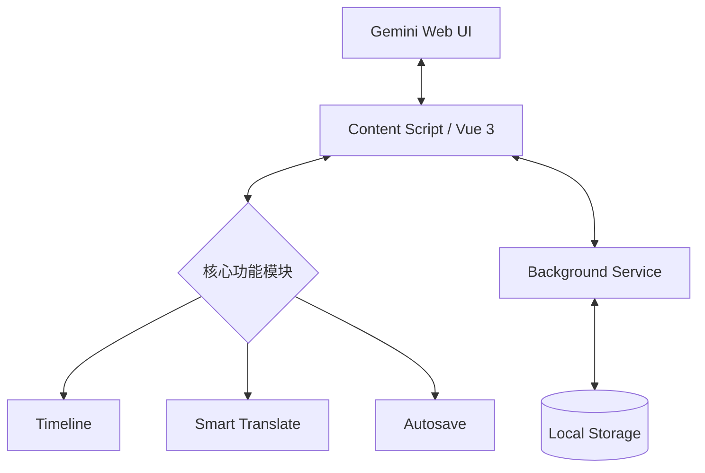

# Gemini Pro Max // 浏览器扩展

极简、高效的 Google Gemini 交互增强工具。

## 核心功能

- **时间线 (Timeline)**：可视化对话历史，实现快速跳转与回顾。
- **智能翻译 (Translate)**：对模型思维过程 (Thought) 及响应进行实时翻译。
- **自动保存 (Autosave)**：强大的后台草稿持久化，防止内容丢失。

## 系统架构



## 技术栈

- **内核**: Vue 3 + TypeScript
- **打包**: Vite + [CRXJS](https://crxjs.dev/)
- **状态**: Pinia

## 开发流程

### 初始化

```bash
npm install
```

### 开发模式

```bash
npm run dev
```

1. 打开 Chrome 扩展程序 (`chrome://extensions`)
2. 开启 **开发者模式**
3. 点击 **加载已解压的扩展程序**，选择项目中的 `dist` 目录。

### 生产构建

```bash
npm run build
```

---

_Stay geek._
